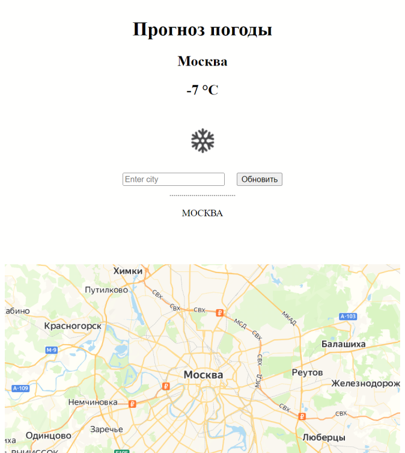
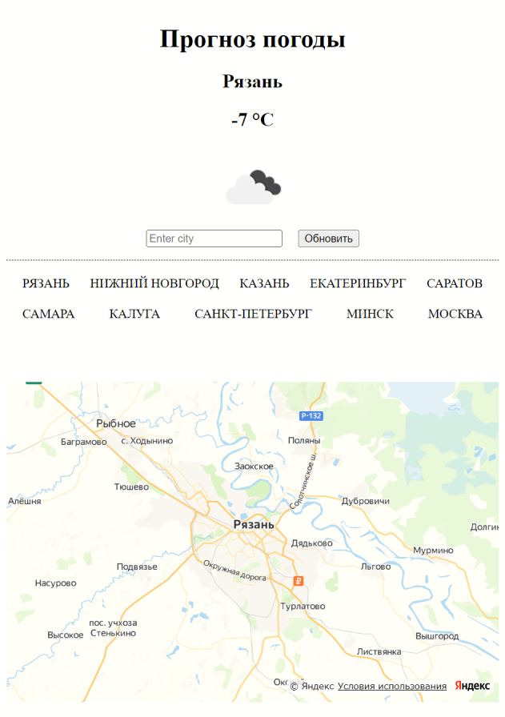

   

# Курс "JavaScript Developer. Basic" | OTUS

## Домашнее задание - Приложение "Прогноз погоды"

  

## Описание

При запуске приложение использует данные о местонахождении пользователя по IP-адресу и показывает погоду для данного города.
При получении погоды город сохраняется в список из 10 последних городов поиска, список хранится на стороне пользователя и доступен при последующих запусках.
После получения погоды на карте отображается местоположение пользователя.

Рабочая версия проекта доступна по ссылке: [https://v-nvtsk.github.io/js-weather/](https://v-nvtsk.github.io/js-weather/)

  

## Детальное описание

- [x] Сборка проекта выполняется с использованием webpack. Сборку можно выполнить запуском npm скриптов:
  `development` сборка:

  > npm run build:dev

  `production` сборка:

  > npm run build:prod

  запуск локального веб-сервера по адресу http://127.0.0.1:3000 выполняется скриптом:

  > npm start

- [x] при открытии страницы пользователь видит погоду (город, температуру и иконку) в своей местности

  > Для получения местоположения пользователя использован [GeoJS IP Geolocation lookup API](https://www.geojs.io/docs/v1/endpoints/geo/)

  > Для получения прогноза погоды использован [OpenWeatherMap API](https://openweathermap.org/current 'https://openweathermap.org/current')

- [x] пользователь может ввести имя города в поле ввода и увидеть погоду в выбранном городе
- [x] введенные города сохраняются у пользователя в браузере, так что он видит последние 10 городов, где он смотрел погоду. При получении погоды для города, который уже есть в списке, название города перемещается в начало списка, что исключает повторы в списке городов. 
- [x] при клике по строчке города в списке пользователь видит погоду в выбранном городе
- [x] кроме информации о погоде в центре страницы показывает карту для введенного города [(используется Yandex Maps API)](https://yandex.ru/dev/jsapi30/doc/ru/?from=mapsapi)

- [x] Проверено покрытие кода тестами, проверка покрытия выполняется при деплое запуском `test` скрипта. Покрытие не ниже 60%

### Критерии оценки:

- [x] создан репозиторий на гитхабе, проект c package.json, настроены линтеры, хаски, github actions - 2
- [x] настроены `dev` и `build` скрипты, сборка делается с помощью с использованием webpack - 2
- [x] при открытии страницы пользователь видит свой город и прогноз погоды в своем городе - 2
- [x] пользователь может ввести адрес/город и увидеть прогноз погоды - 2
- [x] введенные города сохраняются у пользователя в браузере, так что он видит последние 10 городов, где он смотрел погоду (_записи в истории не повторяются_) - 2
- [x] при клике по строчке города в списке истории он видит погоду в выбранном городе - 2
- [x] вместе с погодой показывается картинка карты местности для точки - 2
- [x] сделана публикация на githubpages (_с помощью github action_) - 2
- [x] покрытие кода выше 60 %, покрытие проверяется на CI - 2
- [x] ссылка на страницу для просмотра погоды добавлена в адрес страницы репозитория - 1
- [x] в репозитории есть README.md, который содержит описание проекта (что делается, зачем, где смотреть) и описывает структуру проекта - 1
- [x] в README.md есть badge для отображения статуса проверок на основной ветке (линтеры и тесты) - 1

**Задание считается принятым при 18 баллах**
